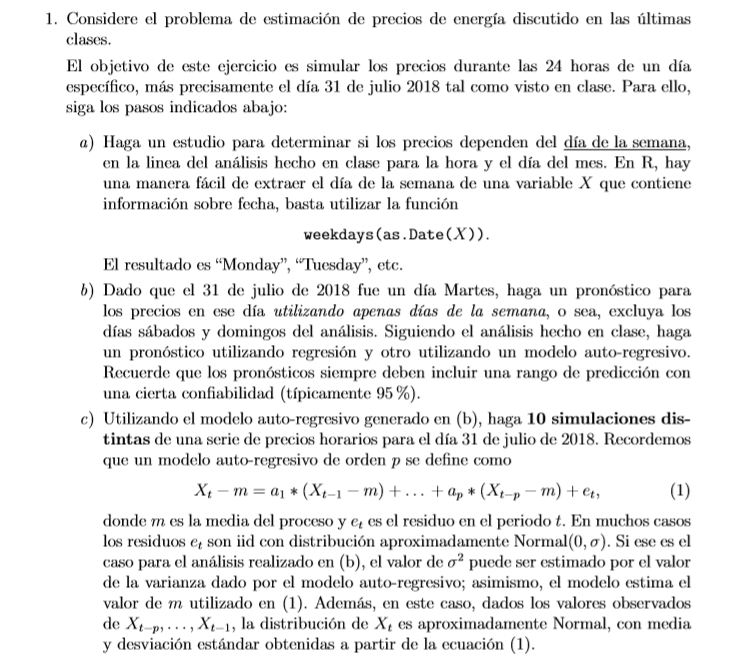
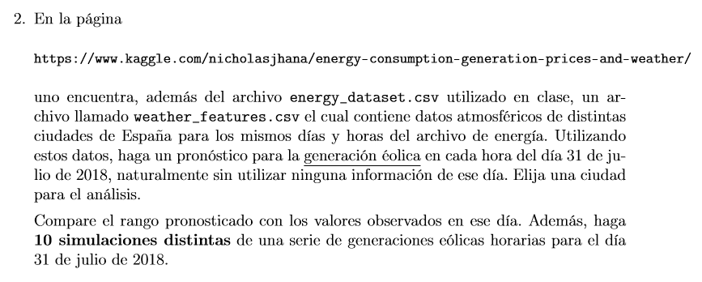

*Jacqueline Meza*

*Francisco Ferrada*

```{r}
library(data.table)
library(goftest)
library(fitdistrplus)
library(stats)
library(dplyr)
```

## Pregunta 1,

## A.
## WENA FERRADIXXXXX


```{r}
energy <-fread("energy_dataset.csv")
energy
```


```{r}
for (i in names(energy)) {
  var <- energy[is.na(energy[[i]]), .(time),]
  if (length(var$time) !=0) {
    print(length(var))
    names(var) = i
    cat('fechas en donde la variable ',i,' toma valores NA: \n')
    print(var)
  }
}
```
##### *** Gracias al output, podemos ver que las columnas "generation hydro pumped storage aggregated" y "forecast wind offshore eday ahead" no contienen información, por lo que las extraemos del dataframe. ***
```{r}
energy <- subset(energy, select = -c(`generation hydro pumped storage aggregated`,`forecast wind offshore eday ahead`))
```
##### Ahora extraemos todas las lecturas que poseen NA del resto del dataframe, quedando un resultante de 35017 datos.

```{r}
for (i in names(energy)) {
  energy<- energy[!is.na(energy[[i]])]
}
energy
```

## Ahora garantizamos que, al menos, los datos no contienen información nula.


### Ahora extraemos los promedios globales por día de la semana y los ordenamos:


```{r}
price_date<-energy[,.(meanprice=mean(`price actual`)),by=weekdays(as.Date(time))]
# Ordenar los datos:
price_date$weekdays <- ordered(price_date$weekdays, levels=c("lunes", "martes", "miércoles", "jueves", 
"viernes", "sábado", "domingo"))
price_date<-price_date[order(price_date$weekdays)]
price_date
```
```{r}
plot(price_date$meanprice, xlab= "Dia de la semana", ylab = "Precio")
```

#### Discusion:
Preliminarmente podemos ver que el precio depende, en promedio, del dia de la semana.Siendo Sábado y domingo los días que tienen precios más bajos (posición 4 y 5 del gráfico).

Sin embargo, queremos ver si eventualmente puede tener una relación con el año y/o mes..

```{r}
years<-c('2015','2016','2017','2018')
DiasSemana <-c("lunes", "martes", "miércoles", "jueves","viernes", "sábado", "domingo")
comodin<- energy[year(as.Date(time))=='2015',.(meanprice=mean(`price actual`)),by=weekdays(as.Date(time))]
comodin$weekdays <- ordered(comodin$weekdays, levels=DiasSemana)
BY_YEARS<-comodin[order(comodin$weekdays)]
for (i in years[2:4]){
  comodin<-energy[year(as.Date(time))==i,.(meanprice=mean(`price actual`)),by=weekdays(as.Date(time))]
  comodin$weekdays <- ordered(comodin$weekdays, levels=DiasSemana)
  comodin<-comodin[order(comodin$weekdays)]
  BY_YEARS<-cbind(BY_YEARS,comodin$meanprice)
}
names(BY_YEARS) <- c('Dias Semana',years)
BY_YEARS
```


```{r}
#Plot
plot(BY_YEARS[[years[1]]], xlab = "Año", ylab = 'Precio', col = 1)

for (i in 2:4){
  par(new = TRUE)
  plot(BY_YEARS[[years[i]]], xlab = "", ylab = "",col = i,yaxt = "n")
}
legend("bottomleft",legend = years,col= 1:4, pch=1,bty="n") 
```

Como era de esperarse, todos los años mantienen el mismo comportamiento con respecto a los días de la semana que un promedio global de estos. Ahora veamos por mes...
```{r}
nombres =c('dias','enero','febrero','marzo','abril','mayo','junio','julio','agosto','septiembre','octubre','noviembre','diciembre')
aux<- energy[month(as.Date(time))==1,.(mean(`price actual`)),by=weekdays(as.Date(time))]
aux$weekdays <- ordered(aux$weekdays, levels=DiasSemana)
dta<-aux[order(aux$weekdays)]
for (i in 2:12) {
  aux<- energy[month(as.Date(time))==i,.(mean(`price actual`)),by=weekdays(as.Date(time))]
  aux$weekdays <- ordered(aux$weekdays, levels=DiasSemana)
  aux<-aux[order(aux$weekdays)]
  dta <-cbind(dta,aux$V1)
}
names(dta) = nombres
dta
```


```{r}
#Plot
plot(dta[['enero']], xlab = "dia de la semana", ylab = 'Precio', col = 1)
for (i in 3:13){
  par(new = TRUE)
  plot(dta[[nombres[i]]], xlab = "", ylab = "",col = i,yaxt="n")
}
legend("bottomleft",legend = nombres[2:13], col=c(2,3,4,5,6), pch=1,bty="n") 
```


Podemos ver como, cuando visualizamos por mes, en todos los casos los fines de semana son más bajos.


De estos análisis podemos rescatar que, posiblemente la demanda de electricidad los sábados y domingos es más baja.Y como vimos en clases, la demanda y el precio están correlacionadas.

Adicionalmente, podemos agregar que el comportamiento de los precios, ya sea promediando los días según filtros de años o meses, siguen el mismo comportamiento, por lo que podemos asegurar que los fines de semana, efectivamente los precios son más bajos. Con esto podemos concluir, visualmente ,que existe una correlación entre el día de la semana y el precio actual.

Esto es útil porque nos permite los días no hábiles de la información útil a la hora de pronosticar el comportamiento de un día martes, ya que sabemos que el día martes va a tener comportamientos más parecidos a los de un día de semana que a un Sábado o un Domingo.


# B.


```{r}
DATA<-energy[format(as.Date(time),"%Y")<="2018"&months(as.Date(time))=="julio"&
                 format(as.Date(time),"%d")<31 & weekdays(as.Date(time)) %in% DiasSemana[1:5]]
data7<-DATA[,.(year=as.integer(format(as.Date(time),"%y")),   #Convierte a valor yy
               day= as.integer(format(as.Date(time),"%d")), 
               time= as.ITime(time),
                solar=`forecast solar day ahead`,
                wind=`forecast wind onshore day ahead`,
                load=`total load forecast`,
                dayahead=`price day ahead`,
                actual=`price actual`)]


test7<-energy[format(as.Date(time),"%Y")=="2018"&
                months(as.Date(time))=="julio"&format(as.Date(time),"%d")==31 & weekdays(as.Date(time)) %in% DiasSemana[1:5],.(year=as.integer(format(as.Date(time),"%y")),day= as.integer(format(as.Date(time),"%d")),time=as.ITime(time),solar=`forecast solar day ahead`,wind=`forecast wind onshore day ahead`,load=`total load forecast`,dayahead=`price day ahead`)]

price7_test<-energy[format(as.Date(time),"%Y")=="2018"&months(as.Date(time))=="julio"&
                      format(as.Date(time),"%d")==31 & weekdays(as.Date(time)) %in% DiasSemana[1:5] ,`price actual`]
```


```{r}
pairs(data7)
```


```{r}
mod7<- with(data7, lm(formula= actual~year+day+time+solar+dayahead+wind+load))
summary(mod7)
```
* Tomar en consideracion el valor del r^2 *


```{r}
fore_hour<-predict(mod7,newdata=test7)
plot(0:23,fore_hour,pch=1,col = 2,type="l",lty=c(1,2),ylab="Precio energía",xlab="Horas",
     main="Pronóstico precio 31/7/18")
legend("topleft", legend = "pronóstico", col=2, pch=1)
```


```{r}
res<-resid(mod7)
hist(res)
```

```{r}
descdist(res)
```


```{r}
a_norm<-fitdist(res,"norm")
plot(a_norm)
```
```{r}
res7<-res
h0<-ks.test(res7,"pnorm",mean=a_norm$estimate[1],sd=a_norm$estimate[2])
h1<-cvm.test(res7,"pnorm",mean=a_norm$estimate[1],sd=a_norm$estimate[2])
h2<-ad.test(res7,"pnorm",mean=a_norm$estimate[1],sd=a_norm$estimate[2])
pvalue_norm<-data.frame(DIST="norm",KS=h0$p.value,CvM=h1$p.value,AD=h2$p.value)
pvalue_norm
```


```{r}
fore_hour<-predict(mod7,newdata=test7,level=0.95,int="p")   #Añade intervalo de predicción
matplot(0:23,fore_hour,pch=1,col = c(2,4,4),type="l",lty=c(2,4,4),
        ylab="Precio energía",xlab="Horas",   main="Pronóstico precio 31/7/18 via regresión")
legend("topleft", legend = c("Pronóstico 95%", "Inf.", "Sup."), col=c(2,4,4), pch=1)
```


```{r}
plotm<-cbind(price7_test,fore_hour)
matplot(0:23,plotm,pch=1,col = c(1,2,4,4),type="l",lty=c(1,2,2,2),
        ylab="Precio energía",xlab="Horas")
legend("topright", legend = c("Real","Pronóstico 95%", "Inf.", "Sup."), col=c(1,2,4,4), pch=1) 
```
### Si lo comparamos con el pronóstico realizado en clases...


```{r}
for (i in 1:length(fore_hour)){
fore_hour[i,2]-fore_hour[i,3]
}
mean(fore_hour[,3]-fore_hour[,1])
```
## Margen de error promedio de +-13.03503
# c.
```{r}
acf(data7$actual)
```


```{r}
price7_train<-data7[year==18 & day<=30,actual]
armod7<-ar(price7_train)


```


```{r}
res_ar<-armod7$resid[-(1:armod7$order)]  #Se eliminan los primeros elementos ya que no tienen residuo
plot(res_ar)
sd(res_ar)
```

```{r}
autocovarianza<- acf(res_ar, type = "covariance", plot = FALSE)
autocorrelacion<- acf(res_ar, type = "correlation", plot = FALSE)
```
```{r}
print(autocovarianza)
print(autocorrelacion)
```
```{r}
acf(res_ar)
```


```{r}
hist(res_ar)
```


```{r}
descdist(res_ar)
```


```{r}
a_norm <-fitdist(res_ar, "norm")
plot(a_norm)
```
### Mas detalle en QQ-plot para el an[alisis de las colas.
```{r}
qqcomp(a_norm)
```

```{r}

h0<-ks.test(res_ar,"pnorm",mean=a_norm$estimate[1],sd=a_norm$estimate[2])
h1<-cvm.test(res_ar,"pnorm",mean=a_norm$estimate[1],sd=a_norm$estimate[2])
h2<-ad.test(res_ar,"pnorm",mean=a_norm$estimate[1],sd=a_norm$estimate[2])
pvalue_norm<-data.frame(DIST="norm",KS=h0$p.value,CvM=h1$p.value,AD=h2$p.value)
pvalue_norm
```

```{r}
fore_ar<-predict(armod7,n.ahead=24)   #n.ahead indica cuantos valores queremos predecir
cat(sprintf("Valores pronosticados\n\n"))
fore_ar$pred
cat(sprintf("\n\n"))
cat(sprintf("Errores estándar\n\n"))
fore_ar$se
```
```{r}
plotm<-rbind(fore_ar$pred,fore_ar$pred-1.96*fore_ar$se,fore_ar$pred+1.96*fore_ar$se)
matplot(0:23,t(plotm),pch=1,col = c(2,4,4),type="l",lty=c(2,2,2),ylab="Precio energía",xlab="Horas",  main="Pronóstico precio 31/7/18 via modelo auto-regresivo")
legend("topleft", legend = c("Pronóstico 95%", "Inf.", "Sup."), col=c(2,4,4), pch=1)
```
```{r}
plotm1<-rbind(price7_test,plotm)
matplot(0:23,t(plotm1),pch=1,col = c(1,2,4,4),type="l",lty=c(1,2,2,2),
        ylab="Precio energía",xlab="Horas",
        main="Pronóstico precio 31/7/18 via modelo auto-regresivo")
legend("topleft", legend = c("Real","Pronóstico 95%", "Inf.", "Sup."), col=c(1,2,4,4), pch=1)
```
## c.

Recordar:

Un modelo *auto-regresivo de orden p (AR(p))* se define como 

        x[t] - m = a[1]*(x[t-1] - m) + … + a[p]*(x[t-p] - m) + e[t]

donde m es la media del proceso y e[t] es el residuo en el periodo t.
```{r}
SIMULACIONES <-structure(list(), class = "data.frame")
SIMULACIONES <-rbind(SIMULACIONES,rep(0,24))
for (z in 1:10) {
price7_pro<-data7[year==18 & day==30,actual]
for (j in 1:24){
  p <- 0
  for (i in 24:1) {
    p <- c(p,(price7_pro[i]-mean(price7_pro[1:24]))*armod7$ar[24-i])
    if (i == 24){
      p<-c(p,rnorm(1,0,sd(armod7$resid[-(1:armod7$order)])))
    }
  }
  price7_pro<-c(sum(p)+mean(price7_pro[1:24]),price7_pro)
}
SIMULACIONES<-rbind(SIMULACIONES,price7_pro[1:24])
}
SIMULACIONES<-SIMULACIONES[2:11,]
plot(1:24,SIMULACIONES[1,],type = 'l', ylab = 'SIMULACIONES', xlab = 'Horas', col = 1)
for (i in 2:10) {
  par(new=TRUE)
  plot(1:24,SIMULACIONES[i,],type = 'l', yaxt = 'n', ylab = '', xlab = '', col = i)
}
legend("topleft", legend = 1:10, col=1:10, pch=1)
```


# Pregunta 2.



```{r}
weather <-fread('weather_features.csv')
head(weather)
```


```{r}
names(weather)[1]<-c("time")
weather<-weather[weather$time %in% energy$time & city_name == 'Barcelona']
weather<-merge(x= weather, y= subset(energy, select = names(energy)), by= "time")
weather <-subset(weather, select = -c(`weather_main`,`weather_description`,`weather_icon`))
```
```{r}
for (i in names(weather)) {
  var <- weather[is.na(weather[[i]]), .(time),]
  if (length(var$time) !=0) {
    print(length(var))
    names(var) = i
    cat('fechas en donde la variable ',i,' toma valores NA: \n')
    print(var)
  }
}
```

```{r}
cor(weather[,-c('city_name','time','snow_3h')])
```
```{r}
modelo <- lm(data= weather[,-c('city_name','time','snow_3h')], formula = `generation wind onshore` ~ temp + temp_min+temp_max+pressure+humidity+wind_speed+wind_deg+rain_1h+rain_3h+clouds_all+weather_id)
summary(modelo)
```

```{r}
modelo2 <- lm(data= weather[,-c('city_name','time','snow_3h')], formula = `generation wind onshore` ~ temp + temp_min+temp_max+pressure+humidity+wind_speed+wind_deg+rain_1h+rain_3h+clouds_all+weather_id+`generation biomass`+`generation fossil brown coal/lignite`+`generation fossil coal-derived gas`+`generation fossil gas`+`generation fossil hard coal`+`generation fossil oil`+`generation fossil oil shale`+`generation fossil peat`+`generation geothermal`+ `price actual` + `price day ahead` + `total load actual`+`total load forecast`+`forecast wind onshore day ahead`+`forecast solar day ahead` + `generation wind onshore` +`generation other renewable`+`generation other`+`generation nuclear`+`generation marine`+`generation hydro water reservoir`+`generation hydro run-of-river and poundage`+`generation waste`+`generation solar`)
summary(modelo2)
```
Variables que se descartan:
`generation fossil coal-derived gas`
`generation marine`
`generation fossil oil shale`
`generation fossil peat`
`generation geothermal`
```{r}
modelo <- lm(data= weather[,-c('city_name','time','snow_3h')], formula = `generation wind onshore` ~ temp + temp_min+temp_max+pressure+humidity+wind_speed+wind_deg+rain_1h+rain_3h+clouds_all+weather_id+`generation biomass`+`generation fossil brown coal/lignite`+`generation fossil gas`+`generation fossil hard coal`+`generation fossil oil`+ `price actual` + `price day ahead` + `total load actual`+`total load forecast`+`forecast wind onshore day ahead`+`forecast solar day ahead` + `generation wind onshore` +`generation other renewable`+`generation other`+`generation nuclear`+`generation hydro water reservoir`+`generation hydro run-of-river and poundage`+`generation waste`+`generation solar`)
summary(modelo)
```
Variables que se descartan:
temp
temp_max
pressure
humidity
rain_1h
rain_3h
clouds_all
weather_id
generation biomass
wind_deg
price actual
generation other
```{r}
modelo <- lm(data= weather[,-c('city_name','time','snow_3h')], formula = `generation wind onshore` ~  temp_min+wind_speed+`generation fossil brown coal/lignite`+`generation fossil gas`+`generation fossil hard coal`+`generation fossil oil`+ `price day ahead` + `total load actual`+`total load forecast`+`forecast wind onshore day ahead`+`forecast solar day ahead` + `generation wind onshore` +`generation other renewable`+`generation nuclear`+`generation hydro water reservoir`+`generation hydro run-of-river and poundage`+`generation waste`+`generation solar`)
summary(modelo)
```


`generation fossil brown coal/lignite`
`generation fossil gas`+`generation fossil hard coal`+`generation fossil oil`
 `generation wind onshore` +`generation other renewable`+`generation nuclear`+`generation hydro water reservoir`+`generation hydro run-of-river and poundage`+`generation waste`+`generation solar`
 `total load actual`+`total load forecast`+wind_speed++ `price day ahead` +temp_min +
```{r}
modelo <- lm(data= weather[,-c('city_name','time','snow_3h')], formula = `generation wind onshore` ~  `forecast wind onshore day ahead`+`forecast solar day ahead`)
summary(modelo)
```


```{r}
comodin1 <- weather[year(as.Date(`time`))>'2014',.(media=mean(`generation wind onshore`)),by= month(as.Date(`time`))]
comodin2 <- weather[year(as.Date(`time`))>'2014',.(media=mean(`clouds_all`)),by= month(as.Date(`time`))]

```
```{r}
plot(1:12,comodin1$media,type="l",xlab="Meses",ylab="comportamiento" )
par(new=T)
plot(1:12,comodin2$media,type="l",col=2,yaxt="n", ylab = "", xlab = "")
legend("bottomleft", legend = c("generacion","nubes"), col=c(1,2), pch=1)
```
```{r}
for (i in 1:15){
  for (j in 1:15){
    print(i,j)
    if (cor(weather[,i],weather[,j])[1]>=0.5) {
      cat('\nCorrelacion medianamente alta entre ', names(weather)[i],'y ', names(weather)[j],'.\n')
    }
  }
}
j<-7
cor(weather[,5],weather[,int(j)])
```


```{r}
pairs(subset(weather, select = c(`pressure`,`generation wind onshore`)))
```

```{r}
DATA<-weather[format(as.Date(time),"%Y")<="2018"&months(as.Date(time))=="julio"&
                 format(as.Date(time),"%d")<31]

#data7<-DATA[,.(year=as.integer(format(as.Date(time),"%y")),   #Convierte a valor yy
#               day= as.integer(format(as.Date(time),"%d")), 
#               time= as.ITime(time),
#                solar=`forecast solar day ahead`,
#                wind=`forecast wind onshore day ahead`,
#                load=`total load forecast`,
#                dayahead=`price day ahead`,
#                actual=`price actual`)]
#
#
#test7<-energy[format(as.Date(time),"%Y")=="2018"&
#                months(as.Date(time))=="julio"&format(as.Date(time),"%d")==31 & weekdays(as.Date(time)) %in% #DiasSemana[1:5],.(year=as.integer(format(as.Date(time),"%y")),day= #as.integer(format(as.Date(time),"%d")),time=as.ITime(time),solar=`forecast solar day ahead`,wind=`forecast wind #onshore day ahead`,load=`total load forecast`,dayahead=`price day ahead`)]
#
#price7_test<-energy[format(as.Date(time),"%Y")=="2018"&months(as.Date(time))=="julio"&
#                     format(as.Date(time),"%d")==31 & weekdays(as.Date(time)) %in% DiasSemana[1:5] ,`price actual`]
```

```{r}
for (i in names(weather)) {
  var <- weather[is.na(weather[[i]]), .(time),]
  if (length(var$time) !=0) {
    print(length(var))
    names(var) = i
    cat('fechas en donde la variable ',i,' toma valores NA: \n')
    print(var)
  }
}
```


